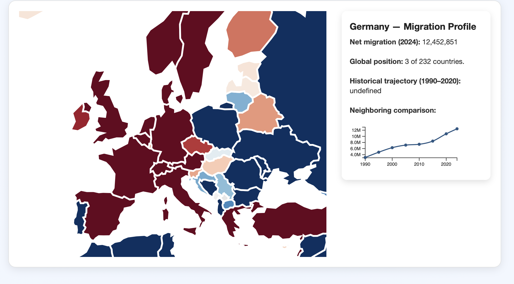

# {A scroll on global migration stocks}
Daniela Ayala

## Goal
My original proposal focused on identifying “migration hotspots” in Latin America and combining multiple socioeconomic indicators into a composite migration-risk index.
However, as I started developing the project — and especially after seeing several personalization  in class — I realized i wanted to build building a narrative experience where users could see migration patterns evolve over time.

Because of this, the project evolved into something more visual, intuitive. A scrollytelling page that lets the user explore trends, map patterns, and corridor flows by simply scrolling through the story.

## Data Challenges

There are no major data challenges — the UN DESA dataset is clean, standardized, and easy to work with.

However, the primary challenge has been scroll-driven interaction, specifically:

- Getting Scrollama to fire steps at the correct time
- Ensuring the sticky elements remain fixed while scrolling
- Aligning the step bars so they activate visuals exactly where expected

## Walk Through
1. I want the user to choose the region or country they want to start exploring so the search bar autocomplets with the possible contries and regions

2. When the user scrolls down they will see the graph and how the text gives more insigts so every scroll is a differnt text. It starts with the line for emigrants and then inmigrants. Both lines are animated and introduces Net migration.

3. The choropleth map shows net migration for the whole world but when scrolling then the user see positive net migration countries and negative ones. The last scroll in this section is a zoom in into the conyty the user choose and the info. the user can click on any other country of the map.

4. Finally the user can scroll once more and see the migrayion flows, They can hover around and look into percentages. 

## Questions

1. When I fix the scrolling, s my current level of interactivity (search bar + scroll-triggered scenes) sufficient, or should I add one more interaction
2. Would it be better to load all the sankey graph for all countries and then just hilighting the selected country. I feel that implies more movement in the layout and updates. 
3
